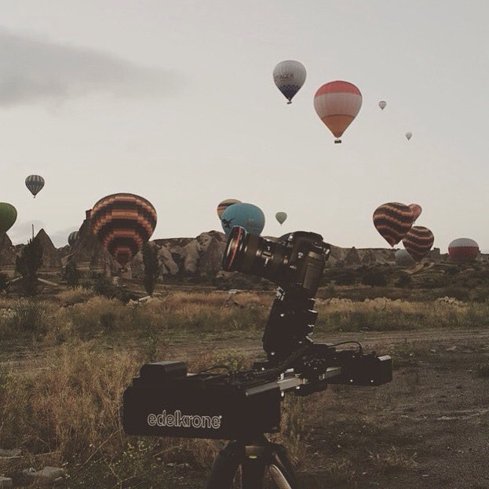

Yotoube’da “<a href="https://www.youtube.com/watch?v=9vXCjVnjVYI&list=PLvM3qEIB5hbNxdrddZQUB6JiIT-A3h3of" target="_blank">Başka Birşey</a>” (Sonradan videolar yayından kaldırıldı) adında bi video serisine denk geldim, bitakım değişik adamlar değişik bişeyler peşindeydi. Yaptıkları çok hoşuma gitti. Biraz araştırınca altından Edelkrone adında bi firma çıktı. Kadir Köymen, eskiden kısa filmler çekip Youtube’da videolarla video prodüksiyon öğretirdi, şimdi Türkiye’nin en inovatif şirketlerinden biri olan Edelkrone ile kendi patentli tasarımlarını üretiyor.

Ofisleri ve yarattıkları “Kuluçka Merkezi” konsepti çok hoşuma gitti. Bikaç hafta sonra başka bi iş için Ankara’ya gittiğimde tanışmak ve Edelkrone hikayesini dinlemek üzere Kadir Bey’le irtibata geçtim, randevulaştık. Cumartesi günü öğle saatlerinde ailesiyle birlikte Tomorrow ofisindeydi, bizi çok güzel karşıladı. 1 saat için konuşmuştuk ama muhabbet o kadar doğal ilerledi ki farkında olmadan 2 buçuk saat geçmiş. Bu yazıda size Edelkrone ve Kadir Köymen’in “farklı” hikayesinden bahsedeceğim.

Kısaca bahsetmek gerekirse Edelkrone 2009 yılında kurulan, ödüllü tasarımlarıyla kamera aksesuarları üreten bir şirket. İnovasyonu ve yeniliği her zaman ön planda tutan vizyoner bir marka olarak Türkiye’de en çok patenti olan şirketlerden biri.

Kadir Köymen ise University of Nottingham’da aldığı makine mühendisliği ve işletme eğitiminin yanında sürekli kısa filmler çeken, sinemaya gönülden bağlı biri.

# “Tomorrow” Ofisi

Şirketin bugünleriyle alakalı olan bölümünü başka bi merkezde yürütmeye devam edip, yarınlarıyla alakalı bölümünü Tomorrow Ofisi dedikleri Ar-Ge merkezi tadındaki ofislerinde yürütüyorlar. Ziyarete bi arkadaşımla birlikte gittim, ofis standartların dışında eğlenceli ve ilham verici. Burda çalışan kimsenin kendine ait masası yok, belli bi iş tanımları olmadığı gibi proje odaklı çalıştıkları için sürekli yerleri değişiyor. Kullanıma göre tasarlanmış farklı odalar var, mesela odaklanmak üzere yapılmış ve kapısının panjurla kapatıldığı kimsenin sizi rahatsız etmeyeceği çalışma odası. Özellikle panjur seçilmiş ki yavaş açılıp kapansın, girdiğinizde uzun saatler giriş-çıkış yapmadan çalışmaya devam edin. Burda çalışma saatleri yok ve çok farklı bi yönetim anlayışı var, yazının devamında bundan bahsedeceğim. Kahvelerimizi alıp köşedeki koltuklarda sohbete başladık.

Önce biz kendimizden bahsettik, daha sonra sohbet organik olarak devam etti.

# “Kimse Yeni Bişey Peşinde Değil”

Karşımdaki adam gerçekten “değişik” bi adamdı. Yani bunu sadece bu kelimeyle anlatabiliyorum. Girişimcilikle ilgili biçok konuşma ve sunum dinledim, birsürü yazı okudum ama beni bu kadar düşünmeye iten, farklı açılardan bakmamı sağlayan nadir insanlardan. Sohbetin doğal olarak ilerlemesi için hiç soru hazırlamadan geldim ki zaten her cevabı benim için yeni sorular doğuruyor, yeni şeyleri sorgulatıyordu.

“Türkiye’de Girişimcilik” hakkında konuşmaya başladığımızda kimsenin yeni şeyler peşinde olmadığından bahsetti. Edelkrone olarak ellerindeki ürünü satışa sunmak ticari olarak mantıklı olsa dahi, piyasadakilerden farklı olarak bi yenilik getirmedikleri sürece onları satışa çıkarmıyorlar.

# Fikir Değil ‘Problem’

<blockquote name="73e0" id="73e0" class="graf graf--blockquote graf-after--h4">İnsanlar problem çözme peşinde değil. Probleme saplantı derecesinde odaklanmalıyız. Önemli olan ürün değil, fikir değil, ‘Problem’.</blockquote>

Bazen iyi geçen bi etkinlikten sonra ya da güzel geçen bi haftanın sonunda motive olmuş ve çalışmaya hazır bi şekilde buluyorum kendimi. Ama ortada eksik bir şey var, peşinden gidebileceğim, inandığım bi fikrim yok. Bi süredir bu “fikir” meselesine çok takılmıştım. Projelerde nasıl ilerlediklerini ve beyin fırtınası meselesinin nasıl ilerlediğini sorduğumda bana kilit noktanın probleme odaklanmak olduğundan bahsetti.

# Disiplin=İstirahat

Günümüzde en önemli yetkinliklerden zaman yönetimi konusunda neler yaptığını, bu konuyu nasıl aştığını sordum. Zaman meselesinin çok kritik olduğunu ve zamanını iyi yönetenlerin aslında her şeyi başarabileceklerini söyledi. “Yeterince zaman verdiğinizde herkes her şeyi düşünebilir.” Ben dış etkenlerden çok etkilenen biri olarak motivasyonumun dışa bağlı olduğunu söyledim. “O noktada disiplin devreye girer. Kendini motive etmenin bi yolunu bulmalısın. Aslında disiplin demek istirahat demek. Disiplinli insanlar hiç yorulmazlar.”

# 1+1+1≠3

<blockquote name="4f76" id="4f76" class="graf graf--blockquote graf-after--h4">Doğru insanları biraraya getirdiğinde değerleri toplanarak değil, çarpılarak artar. Birbirini tamamlayarak harika işler ortaya çıkarabilirler.</blockquote>

<blockquote name="4ad8" id="4ad8" class="graf graf--blockquote graf-after--blockquote">Eğer yaptığınız işi zaten yapmışlarsa artık ona kasmayın, yeni bi sektör bulun, tutkunuzun peşinden koşun.</blockquote>

<blockquote name="ca85" id="ca85" class="graf graf--blockquote graf-after--blockquote">Sinema sektörünü çok ayrı tutuyorum. Bu sektöre tutkuyla bağlıyım. Toplum olarak hikayelere, uyuşturuculara ihtiyacımız var ve sinema burda çok önemli bi rol oynuyor.</blockquote>

<blockquote name="428b" id="428b" class="graf graf--blockquote graf-after--blockquote">Marka olmak demek insanları iyi hissettirmek demek. İnsanlara memnun kalacakları güvenini vermişsen marka olmuşsundur.</blockquote>

Bu sırada sehpadaki bademlerden atıştıyorduk ve atıştırmanın önemli olduğundan konu açıldı. “Aslında çok basit ve ilkel varlıklarız. Gün içinde atıştırmak beynimize çevrede yiyecek olduğuna ve kıtlık olmadığına ikna etmemize yarar.” Gerçekten bu konuya nereden geldik bilmiyorum ama sohbet çok keyifli ilerliyordu. Bu sırada saatin nasıl geçtiğini anlamamışız, Kadir Bey’in bi e-posta atması gerekiyormuş biz de o sırada biraz daha ofisi inceledik. Ofisin her yerindeki değişik teknolojik oyuncaklar çok ilgimi çekti, kitaplığının fotoğrafını almayı da ihmal etmedim tabi. İçecek birşeyler aldık ve kaldığımız yerden devam ettik.

# Çocukken Tam Bi Maker’dım

<blockquote name="ff13" id="ff13" class="graf graf--blockquote graf-after--h4">Çocukken bulduğum her şeyden yeni bişeyler üretme peşindeydim. Ben 8 yaşındayken eve bi kamera alındı, sokaklarda, tatillerde hep o kamerayla filmler çeker daha sonra onları analog olarak montajlardım. O zamanlar için çok teknolojik ve pahalı bi alet olmasına rağmen ailem o kamerayla oynamamı hiç bi zaman engellemedi. Bilinçli anne-baba’lar çocuklar için çok önemli. Bırakın çocuklar hata yapsın ve hatalarından öğrensin. Eğer sonucunda ölmeyecekse her konuda hata yapsınlar. Onları korkutmaktan ve korumaktan vazgeçin.</blockquote>

Bana kalırsa bu büyükler için de geçerli. Başarısızlıklarımızdan her zaman daha çok şey öğreniyoruz. Yetişkinleri de korumaktan ve korkutmaktan vazgeçin ki risk alabilsinler.

<blockquote name="1213" id="1213" class="graf graf--blockquote graf-after--p">Okullar girişimci değil, girişimciye çalışan yetiştirir. Bazı insanlar liderlik konumunu alır ve peşine takipçileri takar. Bi lider bi takipçiyi anlayamaz, aynı şekilde takipçi de lideri.</blockquote>

# Çok Farklı Bi Yönetim Anlayışı

Şimdi size benim çok hoşuma giden bir sistemden bahsedeceğim. Edelkrone’da 60 kişi çalışıyor, bu çalışanlar maaşlarına, tatillerine, mesai saatlerine, işe alım kararlarına, projelerin onaylanmasına kendileri karar veriyor. Nasıl mı?

Üzerinde çok dikkatle çalışılmış bi yazılım geliştirmişler. Yazılım için önce yetki planları belirleniyor. Şirketteki tüm çalışanlar ellerindeki 100 puanlık yetki puanını diğer çalışanlar için dağıtıyor. Verilen yetki puanlarını kimse bilmiyor sadece yazılımda saklanıyor. Daha sonra bi karar verileceği zaman oylama yapılıyor ve yazılım puanların oranına göre herkesin oyunu değerlendiriyor. İşte bu kadar.

Yani şirketteki her çalışanın, en vasıfsızına kadar hepsinin yönetimde söz hakkı oluyor. Şirkete yeni biri alınacağında onun maaşı herkesin maaşından kesilerek, ortak havuzdan ödeniyor ve işe alım kararlarını çalışanlar veriyor. Haftada iki kere fikirler ve projeler değerlendiriliyor ve hodri-meydan yapılıyor. Projenin devamı veya reddi yine oylamayla belirleniyor. Bana kalırsa bu sistem ortaya çok kolektif bir oluşum ve harika takım çalışmaları çıkarmış. Ben yakın zamanda bu sistemin başarısının kanıtlanacağına inanıyorum.

# Artık Patent Almayacağız

Edelkrone’un Türkiye’de en çok patent alan şirketlerinden biri olduğunu söylemiştim, Kadir Bey bana artık patent almayacaklarını söylüyor. Nedenini sorduğumda ise halkın patentini almanın daha önemli olduğunu, biri ürünlerini taklit etse bile halkın onlardan yana olup onların ürününü tercih edeceğini söylüyor. Umarım öyle olur ama bana kalırsa Edelkrone *bu lig için fazla şerefli*.

# İdoller İdollere Bakarak İdol Olmazlar

Daha sonra kendisine idol olarak gördüğü insanları soruyorum. Hepimiz gibi bazı insanlardan bişeyler öğrendiğini ancak bunların çok üstünde durmadığını söylüyor. İdoller yerine halka odaklanmamız gerektiğini, cevabın orda olduğunu düşünüyor. Yine beklemediğim yerden vuruyor.

# Günde 5 Dakikanı Ver

<blockquote name="d295" id="d295" class="graf graf--blockquote graf-after--h4">Eğer kafanda yeni bişeyler varsa, bi işte iyi olmak istiyosan onun için sadece günde 5 dakikanı ayır. Yarım saat fazla gelebilir, 15 dk için bahane bulabilirsin ama 5dk sana hiçbişey kaybettirmez. Bunu her gün yap. Onu veremiceğin zaman aynaya bakama/yüzüne tükür. Yapamadığında utan kendinden ve kararlı bi şekilde devam et.</blockquote>

# Einstein İzafiyeti Deadline İle Yetiştirdi

<blockquote name="5f00" id="5f00" class="graf graf--blockquote graf-after--h4">Kendine bi deadline koy ve kendini o işi yetiştirmek zorunda bırak. İnsan ne kadar güçlü olduğunu, ancak güçlü olmaktan başka çaresi kalmadığında görebiliyor. Einstein izafiyeti deadline’a bikaç ay kala yetiştirebildi. Yapmak zorunda olduğumuzda yapıyoruz.</blockquote>

# Spor Da Biraz İşlerimiz Gibi

<blockquote name="c279" id="c279" class="graf graf--blockquote graf-after--h4">Beynin patladıktan sonra bile daha da üstüne git. Bu şekilde geliştirebilirsin, bu şekilde sınırını görebilirsin. Spor yapmak gibi, zorlarsan geliştirirsin. Vücudunu bunu yapabileceğine ikna et.</blockquote>

# Küresel Düşünmeliyiz

<blockquote name="d2ef" id="d2ef" class="graf graf--blockquote graf-after--h4">Bugün ülkemizde hayata geçirilen fikirler genelde işe yerel pazardan başlıyor. Özellikle yazılımsal işlerde artık küresel olmak çok kolay. İngilizce bilmiyosan bile tut bi çevirmen, websitene bir de ingilizce seçenek ekle, reklamları dışarıya yönelt. İhracat yapmadığımız sürece girişimcilik bizi anca gelişmiş ülkelerin ivmesine çıkarabilir, onlardan iyi yapamaz.</blockquote>

Edelkrone bugün satışının neredeyse tamamını yurtdışından alıyor. Ben bu düşünceye kesinlikle katılıyorum. Türkiye ne kadar büyük bi pazar olsa da daha büyük düşünmeliyiz.

Kadir Bey’e bu ziyaretin benim için terapi gibi geçtiğini, kendisini daha çok sahnelerde görmek istediğimizi söyledim. Hepimizin ilham alması için de bu yazıyı yazdım. Her türlü yorum ve önerileriniz için lütfen bana ulaşmaktan çekinmeyin.

# <a href="https://medium.com/@koraytekin/edelkrone-hikayesi-ve-kadir-k%C3%B6ymen-1f5a27f1d032" target="_blank">***Yazının Kaynağı : Medium - Koray Tekin***</a>