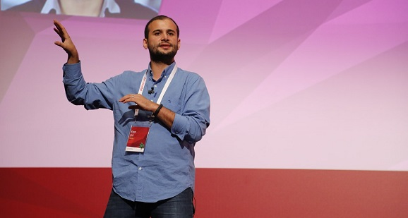
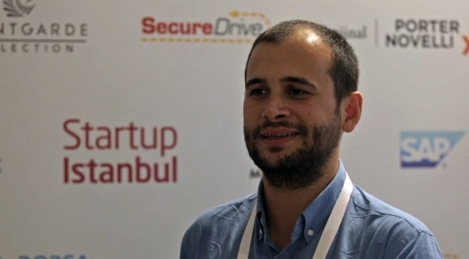

Google, Facebook, Twitter, Instagram... Hepsi milyarlarca dolarlık birer başarı öyküsü. Hikayeleri elbet birbirinden farklı ama en başta tek bir ortak noktaları vardı; iyi bir fikir.

Bundan 30 yıl önce Malatya'nın bir dağ köyünde doğan Eren Bali'nin zekasının ve yeteneklerinin yanında parlak bir fikri vardı. Şansını önce Türkiye'de denedi, olmadı. Ama vazgeçmedi. İşin kalbine, Silikov Vadisi'ne gitti. Bugün 7 milyon kullanıcısı olan Udemy adlı online eğitim platformunun sahibi. 5 yaşındaki şirketi, her yıl 10 kat büyüyor. Başarısını öğretmen olan anne babasına, satranca, bir de Simon'a borçlu. Gerisini kendisinden dinleyelim...

***Şu anda San Francisco'dayız, hikayenizin en başı için binlerce kilometre uzağa, Malatya'ya gidelim. Nasıl başladı?***

Malatya’da Durulova adlı bir dağ köyünde doğdum. İlkokulu da orada okudum. Bir tane öğretmenin 5 sınıf arasında sırayla gezdiği okullardan biriydi. Bu öğretmen de annemdi. Normalin dışında bir şeyler yapmaya başlamam satrançla oldu. 4 yaşındayken yine öğretmen olan babam bana hediye olarak tahtadan el oyması bir satranç takımı yaptı. Babamdan öğrendiklerimi çok hızlı bir şekilde geliştirmeye başladım. Satranç, öğrenmenin dışında bir şeyler daha yapmak için motive etti beni. 1 sene sonra babamı, ondan sonra etraftaki insanları yenmeye başladım, rakip bulmak zorlaşmıştı. İlkokuldayken, özellikle Doğu’da yetenekli çocukları bulmak için yürütülen bir program vardı. Bizim köye gelen müfettiş de beni gördü ve teste aldı. 1 yıl sonunda beni 1 sınıf atlattılar. 4 senede bitirdim ilkokulu.

Ortaokul için köyden taşındık, Malatya merkeze geçtik. Orada yavaş yavaş matematiğe olan ilgim başladı. Matematik öğretmenim bizi kolejler arası bir yarışmaya soktu. Hiçbir beklenti olmadan gittim, 300 kişinin arasından birinci çıktım. Küçükken de farklı bir şeyler yapmak istediğim belliydi, ailem de bunun farkına vardı. Ancak hiçbir zaman bir yarış atı gibi rekabetin içine sokmadılar. Hep 'Dersler bir yerden sonra önemli değil, sevdiğin şeylerle uğraş' dediler. Sonuçta bu tavır yaradı bana. Lisede olimpiyatlara katıldım. Türkiye’de altın madalya, uluslararası matematik olimpiyatlarında da gümüş madalya kazandım.

***Matematik profesörü olmak gibi bir hayaliniz varmış ama gittiğiniz yol bambaşka. Ne oldu o hayale?***

Benden beklenen şey üniversitede matematik okuyup Harvard, MIT gibi bir üniversitede master, doktora yapmam, sonra da akademisyen olmamdı. Benim de o zamanki düşüncem buydu. Ama üniversiteye başladığım zaman daha birinci sınıfta bir proje yaptık. Şahsi bilgisayarlarımız yoktu, çoğu zaman ödevlerimizi okulun laboratuvarlarında yapıyorduk. Müzik dinlemek için de o bilgisayarları kullanıyorduk. Yazın staja gidecek arkadaşların bilgisayarlarında müzik dinleyebilmeleri için internet üzerinde çalışan bir müzik uygulaması yaptım. Artık tüm uygulamaların bulut üzerinden çalışması bekleniyor ama o zaman böyle bir kavram yoktu. Ben de aslında ihtiyaçtan dolayı, bunu internet üzerinden çalışabilir hale getirdim. O zaman insanların ihtiyacı olan bir şey yapmaktan, problemlerini çözmekten keyif aldığımı hissettim. Üniversitenin başlangıcında bunu fark etmemle akademisyen olmaktan vazgeçtim. Çok zor bir karardı ama girişimcilik yapmak istedim. Ailem de hiçbir zaman 'Neden master, doktora yapmadın' demedi, 'Sana güveniyoruz' dediler.

***Girişimci olmaya erken yaşta karar vermişsiniz, tamam. Peki milyonlarca kişinin ders aldığı bir eğitim platformu kurma fikri nasıl düştü aklınıza?***

Bu fikir tamamen şahsi hikayemden çıktı. Tüm dünyada böyle bir problem var, eğitimde fırsat eşitliği yaratmak mümkün değil. Ama internetin kendisi çok ciddi fırsat eşitliği sağlayan bir platform. Çünkü dünyanın her yerinden insanların aynı kaynaklara ulaşmasını sağlıyor. Başlangıçta, 'İnternetten matematik dersleri mi versek?' dedik.

Ama işin içine girdikçe bunun çok daha büyük olabileceğini düşündük. Ortağım Oktay Çağlar'la 'Öyle bir şey yapalım ki, tüm dünyadaki eğitim kavramını etkilesin' dedik. Daha Türkiye'deyken bir eğitim platformu yapmak için kolları sıvadık. 4’üncü sınıfta ben şirketi kurdum. Finansal kaynak olsun diye, geceleri Silikon Vadisi'ndeki şirketlere çalışıyorduk. Oradan kazandığımız gelir sayesinde küçük bir ekiple işimizi yürütüyorduk. Uzun süre çalıştık, çok güzel bir uygulama yaptık. Ama istediğimiz yere gelemedik. Tabii şu an geri dönüp bakınca, hataların ne olduğunu anlıyorum. Biririncisi, biz 2007’de Türkiye’de başladığımızda aslında fazla erkendi. Bir de bazı şirketlerin bazı özel noktalarda kurulması gerekiyor. Udemy’yi Silikon Vadisi’nde kurmamız gerekiyordu. Onun yeri Silikon Vadisi'ydi.

***Amerika’ya nasıl geldiniz?***

Silikon Vadisi’ndeki şirketlerle artık tanışıklığımız vardı. Uzmanlık alanlarımıza ihtiyaç olduğunda bizimle çalışıyorlardı. Şirketimizi kurduktan 1 yıl sonra, Türkiye’de o dönem bu işi yapamayacağımızı fark ettik. Şirketi kapattık, ortağım askere gitti. Ben de bu boşluğu fırsat bilip o şirketlerden birine tam zamanlı olarak geldim. Bu sayede Silikon Vadisi’nde nasıl ürün tasarlıyorlar, nasıl büyütüyorlar, şirket kültürü nasıl, bu konularda fikir edinmiş oldum. Birkaç sene sonra ‘Udemy’yi burada tekrar deneyelim’ dedik. Bu kez Türkiye’de yaptığımızın tersini yapmaya başladık. Geceleri Udemy için çalışıyordum, gündüzlerimi çalıştığım şirkete ayırıyordum.

***Silikon Vadisi’ne gelince hayalindeki gibi bir yerle mi karşılaştın?***

Pek sayılmaz. Büyük teknolojik binaların olduğu bir yer beklentisiyle geldim. Oysa burada küçük küçük garajlarda, ufak bahçeli evlerde çalışıyorlar. Facebook’un çıktığı bölgede ev tuttuk, aynı sokaktaydık. Şunu fark ettik ki, Silikon Vadisi tam olarak bizim gibi insanların buluştuğu bir nokta. Burası dünyada bir şeyler üretmek isteyen insanların Oyun alanı. Gayet açık bir yer, bizi hemen kabul ettiler. Hiçbir yabancılık hissetmedik.

***Ve şirketi kurdunuz...***

2009 yılının sonu gibi tekrar Udemy ile uğraşalım dedik, 2010’un başında şirketi kurduk. Yatırımcılarla görüşmeye başladık, çok ünlü birkaç insanla tanıştık. İlginç bir ürün yapmıştık ama onlar yatırım yapmak istemediler. ‘Eğitim iş çok zordur. Daha önce çok fazla insan battı bu alanlarda, siz ayrıca tecrübesizsiniz’ dediler. Sonuçta kimse yatırım yapmadı. 20-30 tane yatırımcı bize ‘hayır’ cevabı verdi.

***Bu retler sizde hayal kırıklığı yarattı mı, geri dönmeyi düşündünüz mü?***

Aldığımız her retten sonra kendimizden şüphe ettik. Ama bizi hâlâ iten küçük de olsa bir şey vardı. O da şuydu: ‘Bu yapacağımız şey dünya için gerçekten önemli. Biz yapmazsak, bir başkası yapacak ve başarılı olacak’ diyorduk. Biz Udemy’yi kurduğumuzda Silikon Vadisi’nde 50’ye yakın şirket vardı benzer işler yapmaya çalışan. Üstelik bizden çok daha tecrübeli, çok daha fazla bağlantıları olan insanlardı. Şu an ise Udemy açık ara birinci durumda, diğer şirketlerin birçoğunun ismi bile duyulmadı.

***Neydi sizi onlardan ayıran?***

Fikrimize olan inancımız, bunun gerçekten dünya için önemli bir şey olduğunu düşünmemiz ve bu motivasyon sayesinde yılmamamız. İlk başladığımızda sıkıntılarla karşılaşınca ‘Olmuyormuş, demek ki herkes haklıymış’ demedik, ‘Bir de şöyle denesek, böyle denesek’ dedik. Ufak ufak başladık, sonra o başarıyı ikiye üçe katladık. Her geçen gün biraz daha geliştirdik. ‘Olduk’ demeden, her gün bir şeyi daha iyi yaparak bir sonraki noktaya geldik. Şirket her sene 10 kat büyür oldu. Şu anda da ona yakın bir büyümeyle devam ediyor.

***Udemy tek hayaliniz değildir herhalde, başka ne var aklınızda?***

Dünyada bir sürü problem var. Eğitimle başladık ama en az onun kadar ilgimi çeken alan sağlık. Bu konuda bir şeyler yapılabilir mi, teknolojiyle bu alanda milyonlarca insanın hayatını değiştirebilir miyiz, bunu düşünüyorum. Enerji çok ilginç bir alan. Mesela dünyayı yok etmek üzereyiz, bunu bir şekilde tersine çevirebilecek bir şeyler yapılabilir mi, bunlar hep düşündüğüm şeyler. Daha uzun yıllar bu problemleri çözmeye çalışacağım. Amaç sadece para kazanmak değil ama çok büyük etkisi olan bir şey yapmak. Bazı insanlar ‘Para kazanma düşüncen yoksa bunu neden kâr amacı gütmeyen bir vakıf çatısı altında yapmıyorsun?’ diyor. Bunu açıklamak isterim. Şirketler teknik olarak kâr amacı gütmesine rağmen, bazen kâr amacı gütmeyen kuruluşlardan çok daha büyük etki yaratabiliyorlar. Bir hayali, şirket olarak kurduğun zaman, o kendi kendine yetebiliyor. Kendi kendine yetebildiği için birkaç yüz kişiye değil milyarlarca insana ulaşma şansın olabiliyor. O yüzden insanların ticari kanallarla da dünyaya hizmet edebileceğini düşünüyorum. Şirketler tamamen kapitalist bir düşünceyle kurulmak zorunda değiller. Zaten Silikon Vadisi kültürünün bir parçası da bu.

***Geldiğiniz noktada ‘İyi ki varsın’ diyeceğiniz kişi kim?***

Tabii ki elimden tutan bir sürü farklı insan oldu. Ama bunlardan bir kişi seçmem gerekirse, bizim ilk başta Silikon Vadisi’ne gelmemizi sağlayan, çalıştığım şirketin kurucusu olan Simon Tisminezky. Hem buraya gelmemizi sağladı, hem geldikten sonra kendimizi yabancı hissetmeyelim diye bize abilik yaptı. Ve onun şirketini bırakıp kendi şirketimi kurduktan sonra bile beni destekledi. Hâlâ da bir sıkıntım olduğu zaman ilk arayacağım kişilerden biri odur. Her zaman yanımda olduğu için teşekkür etmek isterim, iyi ki varsın Simon.

“Ortaokulun başlarındaydık, köyden yeni gelmiştik Malatya’ya. Bir yaz nasıl olduysa, hiç borcumuz yoktu ve tatile gitme planımız vardı. Ben de bilgisayar kavramını duymuştum. Daha görmemiştim ama bir akrabamızın bilgisayarı vardı. O anlatırdı, sıkılmadan saatlerce dinlerdim. O yaz bilgisayar almak istedim. Aile içi bir oylama yaptık, 'Tatile mi gidelim, bilgisayar mı alalım?' diye. Annem sayesinde oylamayı kazandım, yoksa eşitlik oluyordu. Bilgisayar ve internetle tanıştıktan sonra ilk yaptığım şey satranç oynamaktı. O konuda kendimi ciddi olarak geliştirdim. Sonra olimpiyat kavramından haberdar oldum. Kazandığım uluslararası madalya ufkumu açtı.”

# BAŞARILI GİRİŞİMİN SIRRI ONAYLANMAMAK

“İlk başta bize ‘hayır’ diyen yatırımcılar ‘İnsanlar bir diploma olmaksızın bir şey öğrenmek için ne zaman, ne para harcarlar. Oyun oynamak, film izlemek varken neden zamanlarını, paralarını buna harcasınlar?’ diyorlardı. En sonunda 1 milyon dolarlık bir yatırım aldık. O yatırımcıya 3 kez gitmiştik, üçüncü gidişimizde para vermişti. ‘Buradan para kazanabileceğinizi sanmıyorum ama çok azimlisiniz’ demişti. Zaten başarılı bir girişim kurmanın özü, çoğunluğun o fikrin başarısız olacağını düşünmesidir. Eğer tüm dünyadan farklı bir görüşün varsa ve sonunda sen haklı çıkarsan, işte o zaman milyar dolarlık şirketler, Facebook’lar, twitter’lar ve Udemy’ler oluşuyor.”