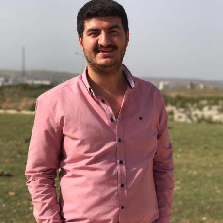
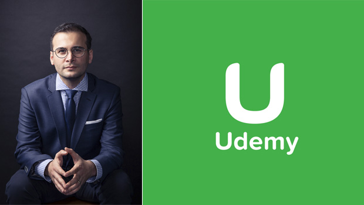

<!-- Main -->

<!-- One -->
<section id="one">
	

		<header class="major">
			<h2>Moorhead</h2>
		</header>
		
Hiç kimse başarı merdivenlerini elleri cebinde tırmanmamıştır !

	

</section>

<!-- Two -->
<section id="two" class="spotlights">
	<section>
		
		

			

				<header class="major">
					<h3>Mustafa GÜNEŞ</h3>
				</header>
				
Yazılımla lisenin başlarında tanışmıştım. O dönemlerde "Bu oyunları nasıl yapıyorlar, Bu butona bastığımda beni nasıl anlıyor" falan diye sorgularken meslek lisesi bilgisayar bölümü okuyan arkadaşımın bilgisayarın dilleri var 0 ve 1 den oluşan rakamlarla derdini anlatıyorsun demişti. Aslında hikayemin heyacanlı kısmına gelmedim hala.   
				Özgeçmişim ve hakkımda daha fazlası için tıkla !

				<ul class="actions">
					<li><a href="hakkimda.html" class="button next">Hakkımda ...</a></li>
				</ul>
			

		

	</section>
	<section>
		
		

			

				<header class="major">
					<h3>“Edelkrone” Hikayesi ve Kadir Köymen</h3>
				</header>
				
Yotoube’da “Başka Bir Şey”(Sonradan videolar yayından kaldırıldı) adında bi video serisine denk geldim, bitakım değişik adamlar değişik bişeyler peşindeydi. Yaptıkları çok hoşuma gitti. Biraz araştırınca altından Edelkrone adında bi firma çıktı ...

				<ul class="actions">
					<li><a href="edelkrone-kadir-koymen.html" class="button">Yazının Devamı ...</a></li>
				</ul>
			

		

	</section>
	<section>
		
		

			

				<header class="major">
					<h3>Bir ‘başarı hikayesi’ olarak ben?  Serdar Kuzuloğlu</h3>
				</header>
				
BloombergHT’de Yaprak Özer’in Başarı Hikayeleri programına birkaç defa denk gelmiştim.  
				Böyle programlardan hep korkmuşumdur. Seyirciyken hep büyük bir başarı öyküsünün sırrına ulaşmak istersin; konukken de sürekli bir başarı anlatma stresine düşersin ...

				<ul class="actions">
					<li><a href="m-serdar-kuzuloglu.html" class="button">Yazının Devamı ...</a></li>
				</ul>
			

		

	</section>
	<section>
		
		

			

				<header class="major">
					<h3>Eren Bali</h3>
				</header>
				
Google, Facebook, Twitter, Instagram... Hepsi milyarlarca dolarlık birer başarı öyküsü. Hikayeleri elbet birbirinden farklı ama en başta tek bir ortak noktaları vardı; iyi bir fikir ...

				<ul class="actions">
					<li><a href="erenbali-udemy.html" class="button">Yazının Devamı ...</a></li>
				</ul>
			

		

	</section>
</section>

<!-- Three -->
<section id="three">
	

		<header class="major">
			<h2>Developer Field</h2>
		</header>
		

		<ul class="actions">
			<li><a href="hakkimda.html" class="button next">Click</a></li>
		</ul>
	

</section>

