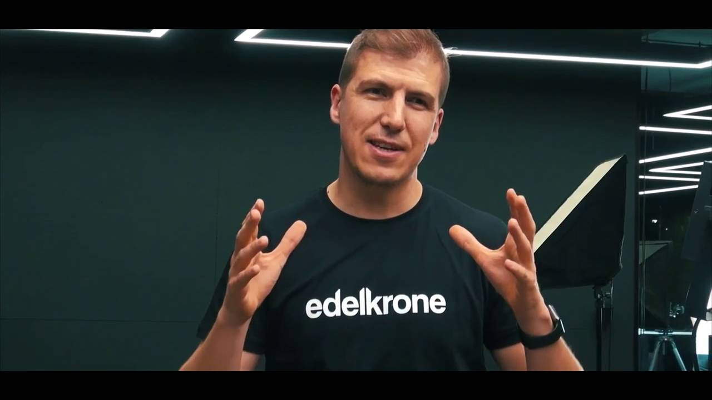
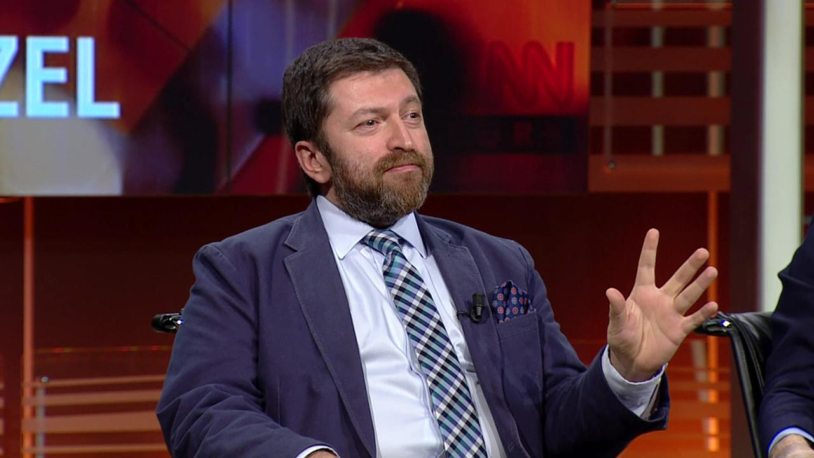

<!-- Main -->

<!-- One -->
<section id="one">
	

		<header class="major">
			<h2>Moorhead</h2>
		</header>
		
Hiç kimse başarı merdivenlerini elleri cebinde tırmanmamıştır !

	

</section>

<!-- Two -->
<section id="two" class="spotlights">
	<section>
		
		

			

				<header class="major">
					<h3>“Edelkrone” Hikayesi ve Kadir Köymen</h3>
				</header>
				
Yotoube’da “Başka Bir Şey”(Sonradan videolar yayından kaldırıldı) adında bi video serisine denk geldim, bitakım değişik adamlar değişik bişeyler peşindeydi. Yaptıkları çok hoşuma gitti. Biraz araştırınca altından Edelkrone adında bi firma çıktı ...

				<ul class="actions">
					<li><a href="edelkrone-kadir-koymen.html" class="button">Yazının Devamı ...</a></li>
				</ul>
			

		

	</section>
	<section>
		
		

			

				<header class="major">
					<h3>Bir ‘başarı hikayesi’ olarak ben?  Serdar Kuzuloğlu</h3>
				</header>
				
BloombergHT’de Yaprak Özer’in Başarı Hikayeleri programına birkaç defa denk gelmiştim.  
				Böyle programlardan hep korkmuşumdur. Seyirciyken hep büyük bir başarı öyküsünün sırrına ulaşmak istersin; konukken de sürekli bir başarı anlatma stresine düşersin ...

				<ul class="actions">
					<li><a href="m-serdar-kuzuloglu.html" class="button">Yazının Devamı ...</a></li>
				</ul>
			

		

	</section>
	<section>
		
		

			

				<header class="major">
					<h3>İlknur Karaaslan</h3>
				</header>
				

Marcello Fiocco dördüncü sınıftayken, öğretmeni tüm sınıfa sıradışı bir alıştırma verdi. Onlardan her gün gördükleri bir objeyi gözlemlemelerini istedi — bu bir masa olabilirdi veya bir pencere —  ve yeniden görmelerini. Bu anı hiç unutmadı ve yıllar sonra felsefe üzerine yüksek lisans eğitimi almaya karar vermesinde etken oldu.
				  
				Bugün Fiocco kendi sınıflarında bunun gibi anlamlı anlar yaratmaya çalıştığı Irvine’daki Kaliforniya Üniversitesi’nde felsefe profesörüdür. Ama bunu yalnızca üniversite öğrencileri için yapmıyor. Yerel ilkokullara gidiyor ve yanında yüksek lisans öğrencilerini de götürüyor.
				  
				Fiocco projesine “TH!NK” adını verdi. Çok basit bir tasarım: Bir filozof dört hafta boyunca, her hafta bir saat olmak üzere aynı grup ilkokul öğrencilerini ziyaret eder. Filozof seslice kısa bir parça okur — genellikle bir hikaye —sonrasında hikaye üzerine çocuklarla felsefi tartışma başlatıp yönlendirmeye başlar. Fiocco’nun bana yönelttiği tipik bir soru: “Şeffaf bir şekle sahip olabilir miyiz?” ya da Küçük Prens’ten bir alıntı yaparak tartışma lideri şöyle sorabilir: “ Ayın sahibi olabilir miyim?”
				  
				Çocuklar bu zor sorulara hevesle cevap veriyorlar. Felsefe yüksek lisans öğrencisi Kourosh Alizadeh “Hepsi cevap vermekten ya da tartışmalara katılmaktan oldukça heyecan duyuyor ve bunu görmek çok güzel” diye anlattı. “Onları zorlamaya devam ediyoruz.” dedi Fiocco. “Onlara neden diye sormaya devam ediyoruz.” Beşinci sınıf bir öğrencinin haykırışını anımsattı: “Çok fazla düşünüyorum, beynim acıyor!”

				<ul class="actions">
					<li><a href="hakkimda.html" class="button">Yazının Devamı ...</a></li>
				</ul>
			

		

	</section>
</section>

<!-- Three -->
<section id="three">
	

		<header class="major">
			<h2>Mustafa GÜNEŞ</h2>
		</header>
		
Yazılımla lisenin başlarında tanışmıştım. O dönemlerde "Bu oyunları nasıl yapıyorlar, Bu butona bastığımda beni nasıl anlıyor" falan diye sorgularken meslek lisesi bilgisayar bölümü okuyan arkadaşımın bilgisayarın dilleri var 0 ve 1 den oluşan rakamlarla derdini anlatıyorsun demişti. Aslında hikayemin heyacanlı kısmına gelmedim hala. 
		  Özgeçmişim ve yazılımla tanışma hikayem için aşağıdaki butona tıkla !

		<ul class="actions">
			<li><a href="hakkimda.html" class="button next">Hakkımda</a></li>
		</ul>
	

</section>

